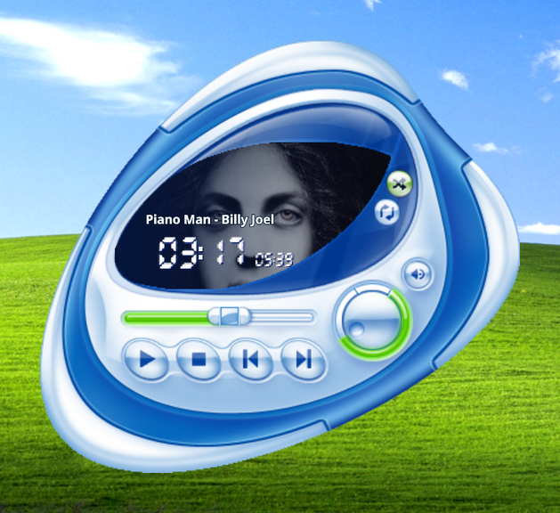

<div align="center">



# Energy Blue Media Controller

**Skeuomorphic Frutiger Aero media controller widget for KDE Plasma 6.**

[](https://kde.org/plasma-desktop/)
[](https://store.kde.org/p/2373784)
[](https://www.qt.io/)
[](https://specifications.freedesktop.org/mpris-spec/latest/)
[](LICENSE)

</div>

---

## Overview

**Energy Blue Media Controller** is a desktop widget (Plasmoid) for KDE Plasma 6, built directly on the original assets and layout of the 2004 **Energy Blue** Windows Media Player skin, interfacing natively with any active media player via the Linux MPRIS2 D-Bus interface.

---

## Features

* 💎 **Skin:** Transparent Energy Blue visual design with no window borders.
* 🖼️ **Album Art:** Displays current artwork masked to the curved screen.
* 🔤 **Marquee Title:** Displays track and artist, scrolling when text exceeds display width.
* 📟 **Digital Displays:** 7-segment readouts for elapsed time and total duration.
* ⏳ **Seekbar:** Supports click-to-seek, drag scrubbing, and mouse wheel adjustments.
* ⏯️ **Transport Controls:** Play/Pause, Stop, Previous, and Next buttons with click feedback.
* 🎛️ **Volume Knob:** Rotary dial adjustable via vertical drag or scroll wheel.
* 🔇 **Mute Button:** Mutes audio and restores prior volume level on unmute.
* 🔀 **Shuffle & Repeat:** Toggles shuffle and cycles repeat across Off, Playlist, and Single Track.
* 📐 **Aspect Scaling:** Proportional resizing preserving original dimensions.

---

## Requirements

* **KDE Plasma:** `6.0` or higher
* **Qt Components:** `Qt 6` (`QtQuick`, `QtQuick.Layouts`, `Qt5Compat.GraphicalEffects`)
* **Plasma Framework:** `org.kde.plasma.plasmoid`, `org.kde.plasma.private.mpris`

---

## Installation

Download the latest `.plasmoid` package from the [Releases](https://github.com/NightCorpse/EnergyBlueMediaController/releases) page and install it using either:

* **Graphical Interface:** Right-click on your desktop $\rightarrow$ **Add Widgets...** $\rightarrow$ **Install from Local File...** and select the downloaded `.plasmoid` file.
* **CLI:**
  ```bash
  kpackagetool6 --type Plasma/Applet --install EnergyBlueMediaController-vx.x.x.plasmoid
  ```

---

## Development & Contribution

To run and test the codebase directly from source:

```bash
git clone https://github.com/NightCorpse/EnergyBlueMediaController.git
cd EnergyBlueMediaController

# Symlink into the local Plasma applets directory
mkdir -p ~/.local/share/plasma/plasmoids/
ln -s "$PWD" ~/.local/share/plasma/plasmoids/org.nightcorpse.energyblue

# Refresh KDE system cache
kbuildsycoca6
```

To test the widget in a standalone window:
```bash
plasmoidviewer -a org.nightcorpse.energyblue
```

---

## Credits & Disclaimer

* **Visual Assets & Design:** Built on the 2004 *Energy Blue* (Royale) skin for Windows Media Player, originally designed by [The Skins Factory](https://www.theskinsfactory.com/) for Microsoft Corporation.
* Windows Media Player and related branding are trademarks of Microsoft Corporation.
* AI-assisted development tools were used during portions of implementation, documentation, and review. All changes were reviewed and tested before inclusion.

---

## License

This project is open-source software licensed under the **GNU General Public License v3.0 or later** ([GPL-3.0-or-later](LICENSE)).
